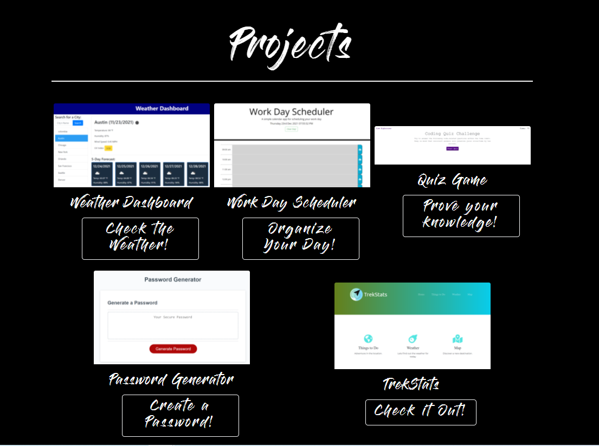

# 08 Project 1: Professional Materials
Now that you've had some practice with APIs and have a project to share, you'll be updating your portfolio page and other materials to build toward being employer-competitive.
If you are opting out of career services, this is still a required assignment. Part of being a web developer means being a part of a community. Having a place to share your projects is necessary if you're applying for jobs, but it's also critical on your journey as a developer.

## Homework Requirements
* Updated portfolio featuring Project 1 and two exemplary homework assignments.
* Updated GitHub profile with pinned repositories featuring Project 1 and two exemplary assignments.
* Updated resume
* Updated LinkedIn profile

## [Link to deployed application](https://mechas8703.github.io/02-Advanced-CSS-Portfolio/)

## * Maria M. Cardona Portfolio

